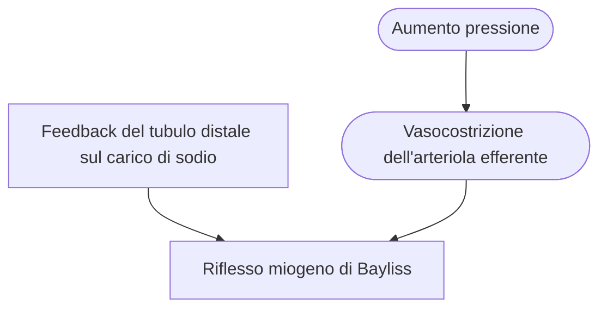

> Sistema di controllo dei valori pressori per attenuare gli effetti su [[Velocità di filtrazione glomerulare (VFG)|VFG]] e [[Flussi ematici renali|FER]].

Il meccanismo del tubulo è detto [[Feedback tubuloglomerulare]].

#Nefrofisiologia